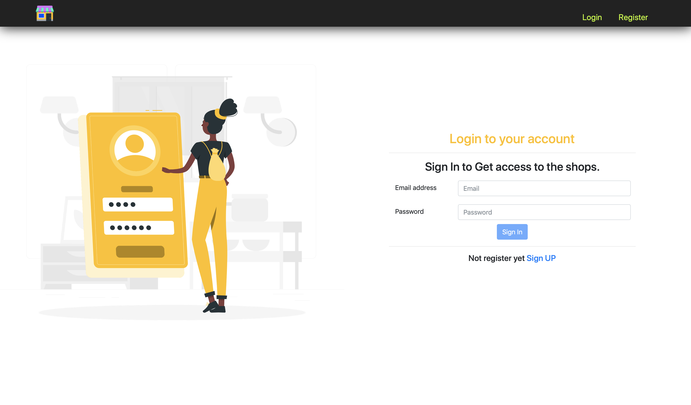
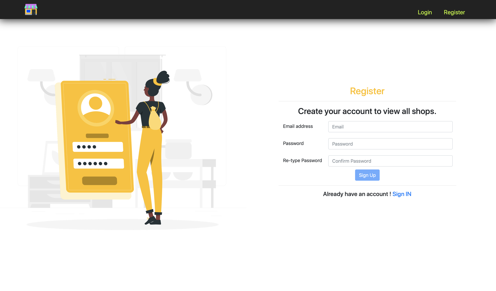

# react-php-shop
This is a simple shop which I've created using React.JS and PHP.
 
Here You can see the login and register pages!
 
pictures from : https://www.freepik.com
 
icon from : https://icons8.com/

STEPS TO RUN:
 
1-cd react
 
2-npm install (this one will install all the front-end dependencies)
 
3-to run the backend just import the react-php-app.sql file in phpMyAdmin ! 
 

# react-php-shop-2019
